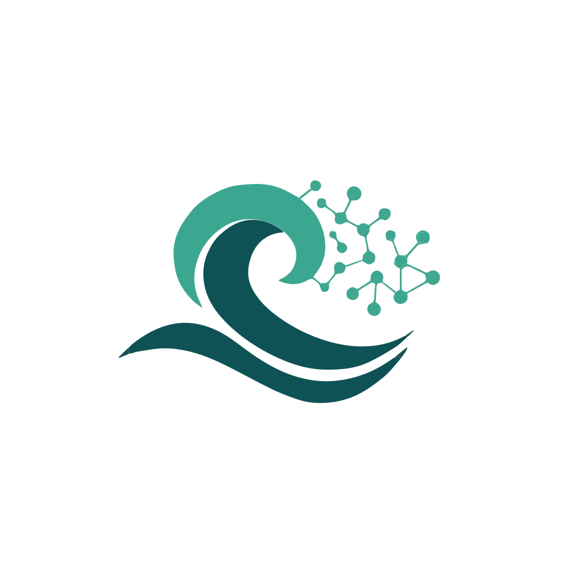

<p align="center">
  
</p>

<h1 align="center">FlowRAG 🌊</h1>

<p align="center">
  <strong>TypeScript RAG library with knowledge graph support.</strong>
</p>

<p align="center">
  <a href="https://github.com/Zweer/FlowRAG/actions/workflows/npm.yml"></a>
  <a href="https://opensource.org/licenses/MIT"></a>
  
</p>

## Table of Contents

- [Why FlowRAG?](#why-flowrag)
- [Installation](#installation)
- [Quick Start](#quick-start)
- [Features](#features)
- [Architecture](#architecture)
- [Packages](#packages)
- [Use Cases](#use-cases)
- [Development](#development)
- [Comparison](#comparison)
- [License](#license)

## Why FlowRAG?

FlowRAG solves common problems with existing RAG solutions:

**🐍 Python Complexity**: No Python environments, virtual envs, or dependency conflicts. Pure TypeScript.

**🖥️ Always-On Servers**: Works as a library, not a service. Import, use, done.

**☁️ Serverless Unfriendly**: Optimized for Lambda with fast cold starts and stateless queries.

**📁 Storage Lock-in**: File-based storage that's Git-friendly. Commit your knowledge base.

**🔗 Missing Knowledge Graphs**: Combines vector search with entity relationships for richer context.

**🔧 Complex Setup**: `npm install` and 10 lines of code to get started.

## Installation

```bash
npm install @flowrag/core @flowrag/pipeline @flowrag/storage-json @flowrag/storage-sqlite @flowrag/storage-lancedb
npm install @flowrag/provider-local @flowrag/provider-gemini
```

Or for a complete local setup:
```bash
npm install @flowrag/pipeline @flowrag/presets
```

For AWS cloud deployment:
```bash
npm install @flowrag/provider-bedrock @flowrag/storage-s3 @flowrag/storage-opensearch
```

## Quick Start

```typescript
import { defineSchema } from '@flowrag/core';
import { createFlowRAG } from '@flowrag/pipeline';
import { createLocalStorage } from '@flowrag/presets';

// Define your schema
const schema = defineSchema({
  entityTypes: ['SERVICE', 'DATABASE', 'PROTOCOL'],
  relationTypes: ['USES', 'PRODUCES', 'CONSUMES'],
});

// Create RAG instance
const rag = createFlowRAG({
  schema,
  ...createLocalStorage('./data'),
});

// Index documents
await rag.index('./content');

// Search
const results = await rag.search('how does authentication work');
```

## Features

### Schema-Flexible

Define your own entity and relation types with optional custom fields:

```typescript
const schema = defineSchema({
  entityTypes: ['SERVICE', 'PROTOCOL', 'TEAM'],
  relationTypes: ['PRODUCES', 'CONSUMES', 'OWNS'],
  
  // Optional custom fields for richer metadata
  entityFields: {
    status: { type: 'enum', values: ['active', 'deprecated'], default: 'active' },
    owner: { type: 'string' },
  },
  relationFields: {
    syncType: { type: 'enum', values: ['sync', 'async'] },
  },
});

// schema.isValidEntityType('SERVICE') → true
// schema.normalizeEntityType('UNKNOWN') → 'Other'
```

### Graph-First

Trace data flows through your system:

```typescript
// Where does this data come from?
const sources = await rag.traceDataFlow('dashboard-metric', 'upstream');

// Where does this data go?
const consumers = await rag.traceDataFlow('user-event', 'downstream');
```

### Dual Retrieval

Combines vector search with graph traversal:

1. **Vector search**: Find semantically similar chunks
2. **Graph expansion**: Follow entity relationships
3. **Merge & dedupe**: Combine results

### Entity Search

Search entities semantically by description, not just exact name:

```typescript
const results = await rag.searchEntities('the service that handles login');
// [{ entity: { name: 'Auth Service', type: 'SERVICE', ... }, score: 0.92 }]
```

### Reranker (Optional)

Improve result quality with a post-retrieval reranking step:

```typescript
import { LocalReranker } from '@flowrag/provider-local';

const rag = createFlowRAG({
  schema,
  ...createLocalStorage('./data'),
  reranker: new LocalReranker(), // Cross-encoder ONNX, fully offline
});
```

Three implementations available:
- `LocalReranker` — cross-encoder via ONNX (Xenova/ms-marco-MiniLM-L-6-v2), no API needed
- `GeminiReranker` — LLM-based relevance scoring
- `BedrockReranker` — Amazon Rerank API (`amazon.rerank-v1:0`)

### Incremental Indexing

Only re-process changed documents. Content is hashed (SHA-256) and compared on re-index:

```typescript
await rag.index('./content');                  // Skips unchanged docs
await rag.index('./content', { force: true }); // Re-index everything
```

### Document Deletion

Delete a document and automatically clean up orphaned entities and relations:

```typescript
await rag.deleteDocument('doc:readme');
```

### Document Parsers

Pluggable file parsing for non-text documents (PDF, DOCX, images, etc.):

```typescript
const rag = createFlowRAG({
  schema,
  ...createLocalStorage('./data'),
  parsers: [new PDFParser(), new DocxParser()],
});
```

### Citation / Source Attribution

Search results include source references for traceability:

```typescript
const results = await rag.search('how does auth work');
// Each result includes: sources: [{ documentId, filePath, chunkIndex }]
// Plus document metadata fields in result.metadata (e.g., author, domain, version)
```

### Entity Merging

Merge duplicate entities extracted by the LLM:

```typescript
await rag.mergeEntities({
  sources: ['Auth Service', 'AuthService', 'auth-service'],
  target: 'Auth Service',
});
```

### Observability Hooks

Extension points for tracing, monitoring, and token tracking:

```typescript
const rag = createFlowRAG({
  // ...
  observability: {
    onLLMCall: ({ model, duration, usage }) => console.log(model, usage),
    onEmbedding: ({ model, textsCount, duration }) => console.log(model, textsCount),
    onSearch: ({ query, mode, resultsCount, duration }) => console.log(query, duration),
  },
});
```

### Export

Export the knowledge graph in multiple formats:

```typescript
await rag.export('json'); // Entities + relations as JSON
await rag.export('csv');  // Relation table
await rag.export('dot');  // Graphviz digraph
```

### Extraction Gleaning

Multi-pass entity extraction for higher accuracy:

```typescript
const rag = createFlowRAG({
  // ...
  options: { indexing: { extractionGleanings: 2 } },
});
```

### Evaluation

Pluggable RAG quality evaluation:

```typescript
const rag = createFlowRAG({
  // ...
  evaluator: myEvaluator, // implements Evaluator interface
});

const result = await rag.evaluate('query', { reference: 'expected answer' });
// result.scores: { precision: 0.85, recall: 0.72, faithfulness: 0.91 }
```

### CLI

Full-featured command-line interface for local usage:

```bash
# Initialize data directory
flowrag init

# Index documents (with optional interactive entity review)
flowrag index ./content
flowrag index ./content --force          # Re-index all documents
flowrag index ./content --interactive    # Review extracted entities

# Search
flowrag search "how does OCPP work"
flowrag search "OCPP" --type entities    # Search entities
flowrag search "ServiceA" --type relations  # Show entity relations
flowrag search "query" --mode local --limit 20

# Knowledge graph
flowrag graph stats                      # Entity/relation breakdown
flowrag graph export                     # Export as DOT format

# Statistics
flowrag stats
```

### Human-in-the-Loop

Interactive entity review during indexing with `--interactive`:

```
📄 Chunk chunk:abc123 — doc:readme

? Entities — select to keep:
  ◉ [SERVICE]  becky-ocpp16 — "Backend OCPP 1.6..."
  ◉ [PROTOCOL] OCPP 1.6 — "Open Charge Point Protocol..."
  ◯ [OTHER]    WebSocket — "Communication protocol..."

? What next?
  → Continue to relations
    ✏️  Edit an entity
    ➕ Add new entity
    📄 Show chunk content
```

## Architecture

```
┌─────────────────────────────────────────────────────────────┐
│                         FlowRAG                             │
├─────────────────────────────────────────────────────────────┤
│  Schema Definition  │  Pipeline  │  Graph Traversal         │
├─────────────────────┴────────────┴──────────────────────────┤
│                      STORAGE LAYER                          │
│  ┌──────────┐  ┌──────────┐  ┌──────────┐                   │
│  │    KV    │  │  Vector  │  │  Graph   │                   │
│  │ JSON/S3  │  │SQLite/   │  │SQLite/OS │                   │
│  │  Redis   │  │Lance/OS  │  │          │                   │
│  └──────────┘  └──────────┘  └──────────┘                   │
├─────────────────────────────────────────────────────────────┤
│                      PROVIDERS                              │
│  Embedder: Local ONNX │ Gemini │ Bedrock                    │
│  Extractor: Gemini │ Bedrock                                │
│  Reranker: Local ONNX │ Gemini │ Bedrock                    │
└─────────────────────────────────────────────────────────────┘
```

## Packages

| Package | Version | Description | Status |
|---------|---------|-------------|--------|
| [`@flowrag/core`](./packages/core) | [](https://www.npmjs.com/package/@flowrag/core) | Interfaces, schema, types | ✅ Complete |
| [`@flowrag/pipeline`](./packages/pipeline) | [](https://www.npmjs.com/package/@flowrag/pipeline) | Indexing & querying pipelines | ✅ Complete |
| [`@flowrag/storage-json`](./packages/storage-json) | [](https://www.npmjs.com/package/@flowrag/storage-json) | JSON file KV storage | ✅ Complete |
| [`@flowrag/storage-sqlite`](./packages/storage-sqlite) | [](https://www.npmjs.com/package/@flowrag/storage-sqlite) | SQLite graph & vector storage | ✅ Complete |
| [`@flowrag/storage-lancedb`](./packages/storage-lancedb) | [](https://www.npmjs.com/package/@flowrag/storage-lancedb) | LanceDB vector storage | ✅ Complete |
| [`@flowrag/storage-s3`](./packages/storage-s3) |  | S3 KV storage | ✅ Complete |
| [`@flowrag/storage-opensearch`](./packages/storage-opensearch) |  | OpenSearch vector & graph storage | ✅ Complete |
| [`@flowrag/provider-local`](./packages/provider-local) | [](https://www.npmjs.com/package/@flowrag/provider-local) | Local AI provider (ONNX embeddings) | ✅ Complete |
| [`@flowrag/provider-gemini`](./packages/provider-gemini) | [](https://www.npmjs.com/package/@flowrag/provider-gemini) | Gemini AI provider (embeddings + extraction) | ✅ Complete |
| [`@flowrag/provider-bedrock`](./packages/provider-bedrock) |  | AWS Bedrock provider (embeddings + extraction) | ✅ Complete |
| [`@flowrag/provider-openai`](./packages/provider-openai) |  | OpenAI provider (embeddings + extraction) | ✅ Complete |
| [`@flowrag/provider-anthropic`](./packages/provider-anthropic) |  | Anthropic provider (extraction only) | ✅ Complete |
| [`@flowrag/storage-redis`](./packages/storage-redis) |  | Redis KV + vector storage | ✅ Complete |
| [`@flowrag/presets`](./packages/presets) | [](https://www.npmjs.com/package/@flowrag/presets) | Opinionated presets | ✅ Complete |
| `@flowrag/cli` |  | Command-line interface | ✅ Complete |
| `@flowrag/mcp` |  | MCP server for AI assistants | ✅ Complete |

### Development Status
- **✅ Complete**: Fully implemented with 100% test coverage
- **🚧 In Progress**: Currently being developed  
- **📋 Planned**: Scheduled for future development

## Use Cases

### Local Development

```bash
flowrag index ./content    # Index your docs
flowrag search "query"     # Search locally
# DB files committed to Git ✓
```

### AWS Lambda

```typescript
import { defineSchema } from '@flowrag/core';
import { createFlowRAG } from '@flowrag/pipeline';
import { BedrockEmbedder, BedrockExtractor } from '@flowrag/provider-bedrock';
import { S3KVStorage } from '@flowrag/storage-s3';
import { OpenSearchVectorStorage, OpenSearchGraphStorage } from '@flowrag/storage-opensearch';

export const handler = async (event: { query: string }) => {
  const rag = createFlowRAG({
    schema,
    storage: {
      kv: new S3KVStorage({ client: s3Client, bucket: 'my-rag-bucket', prefix: 'kv/' }),
      vector: new OpenSearchVectorStorage({ client: osClient, dimensions: 1024 }),
      graph: new OpenSearchGraphStorage({ client: osClient }),
    },
    embedder: new BedrockEmbedder(),
    extractor: new BedrockExtractor(),
  });

  return await rag.search(event.query);
};
```

## Tech Stack

| Purpose | Tool |
|---------|------|
| Runtime | Node.js >=22 |
| Language | TypeScript (strict, isolatedDeclarations) |
| Build | tsdown (Rolldown-based) |
| Test | Vitest |
| Lint/Format | Biome |
| Schema | Zod |

## Development

```bash
npm install        # Install dependencies
npm run build      # Build all packages
npm test           # Run all tests
npm run test:e2e   # Run end-to-end tests
npm run lint       # Lint code
npm run typecheck  # Type check
```

### Documentation

The docs site is built with [VitePress](https://vitepress.dev/) and includes guides, API reference, provider docs, deployment patterns, and blog posts:

```bash
npm run docs:dev   # Local dev server
npm run docs:build # Build for production
```

AI-friendly `llms.txt` and `llms-full.txt` are auto-generated and served from the docs site.

### Release

Releases are managed by [bonvoy](https://github.com/Zweer/bonvoy) with independent versioning per package. CI runs on every push to `main`: tests (Node 22, 24), e2e, lint, then auto-release and docs deploy.

## Comparison

### FlowRAG vs LightRAG

| Aspect | LightRAG | FlowRAG |
|--------|----------|---------|
| Language | Python | TypeScript |
| Model | Server (always running) | Library (import and use) |
| Indexing | Continuous, real-time | Batch, scheduled |
| Deploy | Container/server | Lambda-friendly |
| Storage | External DBs (Neo4j, Postgres) | File-based (Git-friendly) |
| Complexity | Feature-rich, many deps | Minimal, focused |

## License

MIT

---

*Inspired by [LightRAG](https://github.com/HKUDS/LightRAG), built for TypeScript developers.*
